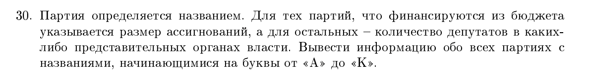

PEP 8
Пишем входные тайпы и выходные тайпы

Вся работа внутри классов

* [ ] 

Он будет развлекаться ввод книг сделать в цикле, он будет херь вбивать

ПОЛИМОРФИЗМ В ПРИНТЕ

если метод только в классе @primary

если только в наследниках @protected

Логичные классы

Названия без сокращений на английском

30 вариант

Задача: 

